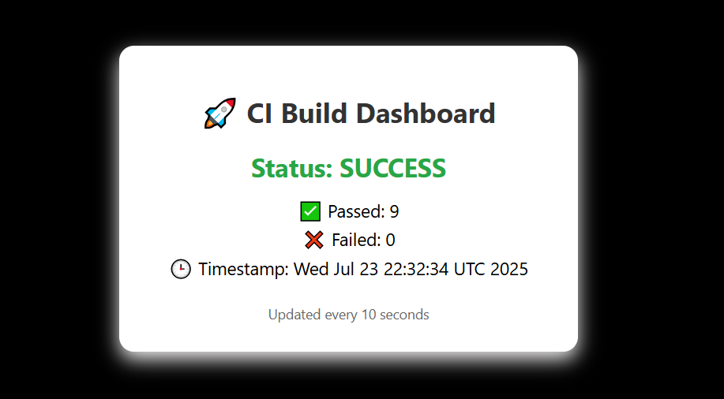

# 🛠️ CI DevOps Dashboard with Jenkins, Docker, Pyhton, Flask & GitHub 


## 🏗️ Project Architecture Overview

This project demonstrates a **CI Dashboard** using Docker, Jenkins, Flask, and GitHub with `ngrok` for public exposure. Here's how all components interact:

---

### 🔁 Workflow

1. **📤 GitHub Push**  
   When code is pushed to the GitHub repository, GitHub sends a **webhook request** to the **public ngrok URL**.

2. **🌐 ngrok Tunnel**  
   `ngrok` securely forwards the webhook to the locally running **Jenkins container**, allowing GitHub to trigger Jenkins jobs even behind NAT/firewalls.

3. **🤖 Jenkins CI Pipeline**
   - Jenkins receives the webhook.
   - The pipeline defined in `Jenkinsfile` gets triggered.
   - It runs the `ci/run_tests.sh` script inside the Jenkins container.
   - This script:
     - Executes the Python unit tests from the `tests/` directory.
     - Parses the test results.
     - Generates or updates a `results.json` file.

4. **📦 Shared Volume**
   - The `results.json` file is written to a **shared Docker volume** mounted by both the Jenkins and Flask containers.
   - This ensures the Flask app can **instantly access the latest test results**.

5. **🌐 Flask Web UI**
   - The Flask container hosts a web interface (`index.html`) that:
     - Reads `results.json`.
     - Dynamically displays test summaries (e.g., total passed, failed, timestamp, status).
---

### 🧱 Component Diagram

```text
  ┌────────────┐        ┌───────────┐       ┌────────────┐
  │ GitHub Repo│──────▶│  ngrok    │──────▶│  Jenkins CI │
  └────────────┘        └───────────┘       └────┬───────┘
                                                │
                                      Runs Shell Script
                                                │
                                   Writes results.json
                                                │
                                Shared Docker Volume (bind mount)
                                                │
                                          ┌─────▼─────┐
                                          │  Flask UI │
                                          └───────────┘

---

## 📁 Project Structure


ci-devops-dashboard/
├── app/                   # Business logic
│   └── main.py
│
├── ci/                    # CI test runner
│   └── run_tests.sh       # Generates results.json after test run
│
├── flaskapp/              # Flask UI
│   ├── templates/
│   │   └── index.html     # Frontend to display test results
│   ├── app.py             # Flask entrypoint
│   ├── Dockerfile         # Flask container build
│   └── requirements.txt
│
├── jenkins/               # Jenkins container
│   ├── Dockerfile
│   ├── Jenkinsfile        # Pipeline script
│   └── plugins.txt        # Preinstalled plugins
│
├── tests/                 # Unit tests
│   └── test_main.py
│
├── docker-compose.yml     # Multi-container orchestrator
├── results.json           # Auto-generated test result (shared volume)
├── README.md              # Project instructions


---

## 🚀 Getting Started

### 1. 🧰 Prerequisites

- Docker & Docker Compose
- Python 3 (optional, for local testing)
- [ngrok](https://ngrok.com/) (free account + CLI)

---

### 2. 🔃 Clone the Repository

```bash
git clone https://github.com/YOUR_USERNAME/ci-devops-dashboard.git
cd ci-devops-dashboard
```

---

### 3. 🐳 Start with Docker Compose

```bash
docker-compose up --build
```

📌 This launches:

- Jenkins at [http://localhost:8080](http://localhost:8080)  
- Flask app at [http://localhost:5000](http://localhost:5000)

---

### 4. 🔑 Jenkins Setup (First Time)

```bash
docker exec -it jenkins cat /var/jenkins_home/secrets/initialAdminPassword
```

- Paste password in browser
- Create admin user
- Restart Jenkins if needed

---

## 🔄 GitHub Webhook Integration

### 5. 🌍 Expose Jenkins to GitHub with ngrok

```bash
ngrok http 8080
```

Copy the HTTPS URL like: `https://abcd1234.ngrok.io`

---

### 6. 🔔 Add Webhook to GitHub

Go to your GitHub repository:

- Settings → Webhooks → Add Webhook  
- **Payload URL**: `https://abcd1234.ngrok.io/github-webhook/`  
- Content type: `application/json`  
- Events: "Just the push event"  
- Click **Add Webhook**

---

## 🧪 How Testing Works

- `ci/run_tests.sh` runs Python unit tests via `unittest`
- Result summary is saved as `results.json`
- Flask app reads `results.json` and updates the dashboard

Example `results.json`:

```json
{
  "status": "FAILURE",
  "passed": 2,
  "failed": 1,
  "timestamp": "2025-07-22 14:35:00"
}
```

---

## ⚙️ Flask UI

- Dynamically shows:
  - ✅ Passed / ❌ Failed test count
  - 🟢 Status label
  - ⏱️ Build timestamp
- Reads from Docker volume-shared `results.json`

---

## 🧪 Running Tests Locally

```bash
# Run all tests manually
bash ci/run_tests.sh
```

Sample test (in `tests/test_main.py`):

```python
import unittest
from main import add

class TestAdd(unittest.TestCase):
    def test_add(self):
        self.assertEqual(add(2, 3), 5)
```

---

## 🐳 docker-compose.yml Summary

Defines:

- Jenkins container (Git, bash pre-installed)
- Flask container with shared volume
- Volumes:
  - `jenkins_home` → Jenkins persistence
  - `shared_data` → for `results.json` sync

---

## 📝 Notes

- If `results.json` is missing, UI handles it gracefully
- Jenkins updates the file after each pipeline run
- GitHub pushes trigger builds via Webhook through ngrok

---

## 📸 Screenshot



---

## 📦 Technologies Used

- Jenkins (CI)
- Flask (UI)
- Bash + Python unittest
- Docker + Docker Compose
- GitHub Webhooks
- ngrok (for tunneling)

---

## 🙌 Author

Built by Abaidullah Asif